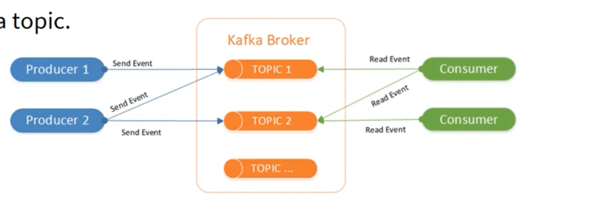

```
Kafka is an event streaming platform.

Event là bất cứ dữ liệu nào được ghi lại theo thời gian thực (như bản ghi trong CSDL)

Event stream là luồng dữ liệu theo trình tự thời gian từ nhiều nguồn dữ liệu khác nhau: dbs, IoT, devices, apps, ...

Kafka lưu dữ liệu trong file đọc lại truy vấn lại

Kafka can be:
+ publish (write) & subscribe (read) luồng sự kiện bao gồm liên tục ghi và đọc từ các hệ thống khác nhau
+ Lưu luồng sự kiện lâu dài & cấu hình thời gian để lưu lại
+ Xử lý luồng sự kiện theo thời gian thực
```

```
Kafka cluster là tập hợp nhiều broker server (production >= 3)

Kafka cluster đảm bảo MỞ RỘNG CAO & KHẢ NĂNG CHỊU LỖI
(Bất cứ con server nào trong cluster bị sập thì các con server khác trong cluster sẽ được nhanh chóng thay thế đảm bảo dự liệu được ghi & đọc dữ liệu liên tục không bị mất dữ liệu)
(Trong thực tế thì những ứng dụng dữ liệu truyền nhiều, tốc độ cao => không thể gửi được hết kafka server cluster => đôi lúc vẫn có lúc mất dữ liệu => cần phải gửi lại, sử dụng cơ chế trạng thái của dữ liệu để gửi đi gửi lại, kafka có hỗ trợ cơ chế chống lặp đi lap lại dữ liệu)
```


```
Broker là Một con server mang hình thức của lớp lưu dữ liệu, sự kiện vào file

Producer (tạo) & Consumer  (đọc) sử dụng kafka broker để trao đổi dữ liệu với nhau bất đông bộ
(Các ứng dụng không trực tiếp liên lạc với nhau mà thông qua kafka broker để trao đổi dữ liệu)

Broker tổ chức lưu trữ 1 & nhiều topics lưu trữ & phân phối dữ liệu
```

```
Producer là ứng dụng gửi event  đến topic trong kafka server

Consumer là ứng dụng đọc event từ topic trong kafka server

Producer & Consumer là ứng dụng chạy độc lập không liên quan với nhau
(Producer Java & Consumer NodeJS, ...)

Producer lên kafka phải có thư viện Serializer để convert đối tượng chuỗi byte[] trước khi gửi lên kafka
Consumer lên kafka phải có thư viện Deserializer để convert chuỗi byte[] về đối tượng ban đầu sau khi đọc từ kafka
```


```
Topic giống danh mục bố trí các event trong kafka broker
(giống table trong database, folder trong hệ thống file)

Topic chỉ ra tên như `nvminh162`

Broker server có nhiều topics

Nhiều producer có thể gửi dữ liệu đến cùng 1 topic, nhiều consumer có thể đọc dữ liệu từ cùng 1 topic
```


```
Trong kafka topics được chia thành nhiều các phần nhỏ gọi là Kafka Topic Partition

Được phân phối trên các broker khác nhau, đảm bảo dữ liệu được phân tán mở rộng, cliên có thể đọc & ghi dữ liệu trên nhiều broker khác nhau trên cùng 1 thời gian

Khi producer gửi event đến topic, event sẽ được ghi vào 1 partition cụ thể trong topic ID được generate tự động hoặc do producer chỉ định
(nếu gửi event lên key giống nhau thì event sẽ được ghi vào cùng 1 partition xác định)
(nếu gửi event lên không với key thì event sẽ được ghi vào ngẫu nhiên 1 partition trong topic)
```


```
Kafka Event's Offset

ID được gắn cho 1 event khi gửi đến trong partition của topic, ID này dùng để xác định vị trí event partition trong topic

Event Offset này được gắn rồi sẽ không thay đổi
```


```
Kafka Partition Repication là sao chép lại partition của topic n lần
=> triển khai trên nhiều broker khác nhau trong kafka cluster

One partition leader & many partition followers
Producer write event đến leader, followers copy lại từ leader

Khi partition Leader fail (Broker 1 bị sập)
=> nhanh chọn broker 2, 3 thay thể trở thành 1 leader mới
(Theo cơ chế replication đảm bảo dữ liệu luôn là online đối với client application)

In production, deploy replication odd 3,5,7,...
(nhiều broker quá sẽ ảnh hưởng đồng bộ dữ liệu sẽ chậm)
```
